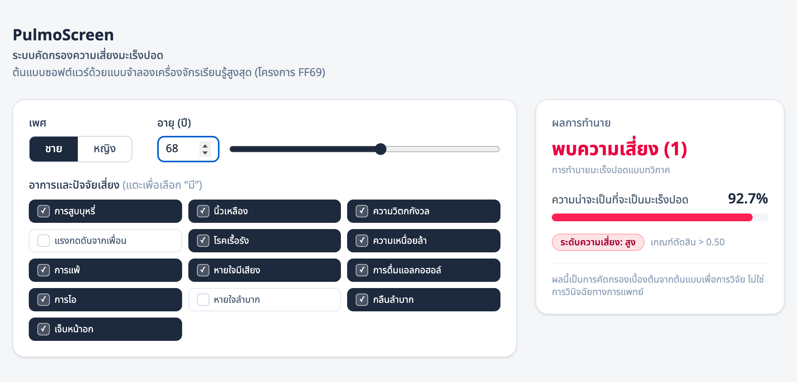

# PulmoScreen

*Lung cancer risk screening — an FF69 research prototype.*

A single-page web application that estimates lung-cancer risk from 15 patient
attributes, using an **Extreme Learning Machine (ELM)** whose output weights
were trained by a generalized two-step inertial parallel subgradient
extragradient method for bilevel variational inequality problems (the *FF69*
research project). FastAPI backend + Next.js frontend.

> ⚠️ **Research prototype — not a medical device.** This tool is for research
> and demonstration only. It is **not** a diagnostic instrument and must not be
> used for clinical decisions. The model was trained on a small (309-sample),
> highly imbalanced (≈6.9 : 1) public dataset and is biased toward the majority
> class at the default 0.5 threshold. No warranty of any kind — see `LICENSE`.



```
api/     FastAPI service — loads the weight checkpoint, exposes /predict
web/     Next.js single page — typed input form + live result panel
tools/   Puppeteer script that regenerates docs/screenshot.png
```

## The model

`api/model/elm_lung_cancer.npz` is a trained checkpoint (committed) holding the
random hidden-layer weights `W`, biases `b`, output weights `u*`, and the age
standardization `(mean, sd)`. The API loads it once at startup and never trains
at request time.

Inference: `q = σ(2·(σ(x·Wᵀ + b) · u*))` with `σ(t) = 1/(1+e⁻ᵗ)`; the class is
`q > 0.5`.

The **training code is not in this repository** — the checkpoint was produced by
the FF69 research pipeline. See `CITATION.cff`.

**Dataset attribution.** The model was trained on the Kaggle *Lung Cancer*
dataset by Mysar Ahmad Bhat
(<https://www.kaggle.com/datasets/mysarahmadbhat/lung-cancer>). The dataset's
own license governs any data-derived use of this checkpoint.

## Run locally

**Backend** (needs [uv](https://docs.astral.sh/uv/)):

```bash
cd api
uv run uvicorn app.main:app --port 8000 --reload
```

Configuration is via environment variables (see `api/.env.example`):
`WEB_ORIGIN` (CORS allow-origin, default `http://localhost:3000`) and
`MODEL_PATH` (checkpoint location, default `./model/elm_lung_cancer.npz`).

| Method | Path       | Purpose                                             |
|--------|------------|-----------------------------------------------------|
| GET    | `/health`  | liveness + hidden-node count                        |
| GET    | `/schema`  | field metadata (label, type, options) for the form |
| POST   | `/predict` | `{gender, age, <13 symptom booleans>}` → prediction |

`POST /predict` response:

```json
{ "label": "YES", "probability": 0.927, "risk": "high", "threshold": 0.5 }
```

`label` (`"YES"` / `"NO"`) is rendered by the frontend as the binary verdict
`1` / `0`. `risk` (`low` / `moderate` / `high`) is a secondary band derived
from `probability`.

**Frontend** (needs Node 20+):

```bash
cd web
cp .env.example .env.local       # NEXT_PUBLIC_API_URL=http://localhost:8000
npm install
npm run dev                      # http://localhost:3000
```

Input controls match each data type: sex is a two-option selector, age is an
integer field (1–120) with a slider, and the 13 symptoms are yes/no chips. The
form and the result sit side by side on one screen (no scrolling); the result
panel is sticky. There is **no submit button** — the prediction is recomputed
automatically (debounced) whenever an input changes.

## Build / deploy

```bash
cd web && npm run build && npm start          # frontend on :3000
```

Set `NEXT_PUBLIC_API_URL` (frontend → backend URL) and `WEB_ORIGIN` (backend
CORS allow-origin) to the real deployment URLs.

## Regenerate the screenshot

With both servers running and Google Chrome installed:

```bash
cd tools && npm install && npm run shot        # writes docs/screenshot.png
```

---

This repo is a mirror of `webapp/` in the private FF69 research monorepo. When
browsing there, prefix the paths above with `webapp/`.
